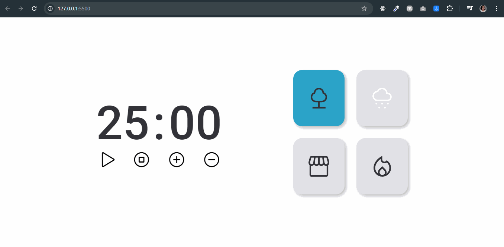

<h1 align="center">Focus Timer 2.0</h1>

Desafio 02: Focus Timer 2.0

  <a href="#tecnologias" style="color: #FFA07A">Tecnologias</a>&nbsp;&nbsp;&nbsp;|&nbsp;&nbsp;&nbsp;
  <a href="#projeto" style="color: #FFA07A">Projeto</a>&nbsp;&nbsp;&nbsp;|&nbsp;&nbsp;&nbsp;
  <a href="#funcionalidades" style="color: #FFA07A">Funcionalidades</a>&nbsp;&nbsp;&nbsp;|&nbsp;&nbsp;&nbsp;
  <a href="#como-executar" style="color: #FFA07A">Como executar</a>&nbsp;&nbsp;&nbsp;|&nbsp;&nbsp;&nbsp;
  <a href="#licença" style="color: #FFA07A">Licença</a>

 

<h3 align="center" style="color: #E9967A">Visualização do Projeto</h3>

  

## 🚀 Tecnologias

Este projeto foi desenvolvido com as seguintes tecnologias:

- HTML e CSS
- JavaScript
- Phosphor Icons
- Google Fonts
- Git e Github
- Figma

## 💻 Projeto

O Focus Timer 2.0 é uma aplicação de cronômetro pomodoro aprimorada, projetada para ajudar os usuários a gerenciar seu tempo de forma eficaz durante sessões de estudo ou trabalho.

## ✨ Funcionalidades

- Cronômetro configurável com minutos e segundos
- Controles de play, pause, stop, aumentar e diminuir tempo
- Sons ambientes selecionáveis (floresta, chuva, cafeteria, lareira)

## 🔖 Como executar

1. Clone este repositório
2. Abra o arquivo `index.html` em seu navegador
3. Use os controles para configurar e iniciar o cronômetro
4. Selecione os sons ambientes desejados clicando nos cards

## 📝 Licença

Este projeto está sob a licença MIT.

